  
  
**最新環境は[OpenEDA-PDK_SetupScript](https://github.com/ishi-kai/OpenEDA-PDK_SetupScript)に移動しました。**  
  
  
# 何か？
ISHI会版OpenMPW用のレイアウトを作るための環境構築用スクリプトです。  
WSL2 (Windows Subsystem for Linux)上のUbuntu22.04 & Ubuntu24.04とUbuntu22.04 & Ubuntu24.04とmacOSで動作します。  

# 実行方法
下記のコマンドを実行するだけです。  

## 共通コマンド
`bash eda-setup.sh`

## PDKのインストール
シャトルに合わせたPDKのインストールが必要です。シャトルに合わせたPDKを**一つだけ**選んでインストールしてください。  
PDKを変更する場合は、一度削除してから再度インストールしてください。  

### フェニテックシャトルPDKの場合
`bash pdk_PTC06-setup.sh`

### 東海理化シャトルPDKの場合
`bash pdk_TR10-setup.sh`

### ミニマルファブPDKの場合
`bash pdk_MF20-setup.sh`

### iHPシャトルPDKの場合
`bash pdk_ihp-sg13g2-setup.sh`

### TinyTapeout PDKの場合
`bash pdk_sky130-setup.sh`

### Wafer.space PDKの場合
`bash pdk_gf180-setup.sh`

## PDKの削除
`bash uninstall.sh`

PDKを変えたい場合はPDK削除後、PDKのみインストールして下さい。

## macOSについて
macOSは微妙なバージョンの違いによりインストールが失敗することがあります。  
また、環境に直接各種ツールやライブラリをインストールするため開発環境への影響を与える可能性があります。それを嫌う場合は、VMWareのイメージを用意してありますので、そちらをお使いください。  
- [Apple Silicon版OR1(フェニテック)用イメージ](https://www.noritsuna.jp/download/ISHI-kai_EDA_vmware_OR1.tar.xz)
- [Apple Silicon版TR10(東海理化)用イメージ](https://www.noritsuna.jp/download/ISHI-kai_EDA_vmware_TR10.tar.xz)
- [Apple Silicon版MF20用イメージ](https://www.noritsuna.jp/download/ISHI-kai_EDA_vmware_MF20.tar.xz)
- [Apple Silicon版iHP用イメージ](https://www.noritsuna.jp/download/ISHI-kai_EDA_vmware_iHP130.tar.xz)
- [Apple Silicon版TinyTapeout用イメージ](https://www.noritsuna.jp/download/ISHI-kai_EDA_vmware_TT.tar.xz)
- [Intel版OR1(フェニテック)用イメージ](https://www.noritsuna.jp/download/ISHI-kai_EDA_Intel.vmwarevm.tar.xz)
- [Intel版TR10(東海理化)用イメージ](https://www.noritsuna.jp/download/ISHI-kai_EDA_Intel.vmwarevm_TR10.tar.xz)
    - ID: ishi-kai
    - Pass: ishi-kai

## WSLイメージ
WSLの環境によってはインストールすることができないことありますので、WSL用のイメージも用意しました。  

- [WSL版OR1(フェニテック)用イメージ](https://www.noritsuna.jp/download/ubuntu2204_ishi-kai_EDA.WSL.tar.xz)
    - ID: ishi-kai
    - Pass: ishi-kai
- [WSL版TR10(東海理化)用イメージ](https://www.noritsuna.jp/download/ubuntu2204_ishi-kai_EDA.WSL_TR10.tar.xz)
    - ID: ishi-kai
    - Pass: ishi-kai

### WSLイメージのインストール
`wsl --import-in-place ubuntu2204_ishi-kai_EDA .\ubuntu2204_ishi-kai_EDA\ext4.vhdx`

上記のコマンドにて認識されます。実行には同梱されている「ubuntu2204_ishi-kai_EDA.lnk」を利用してください。  


### WSLイメージの削除
イメージファイルも削除されてしまうので、注意してください。  

`wsl --unregister ubuntu2204_ishi-kai_EDA`


# xschem
## フェニテックシャトルPDK
### TEGから求めた抵抗・容量の値(2017/9/23:akita11)
#### TEGから求めたシート抵抗（カッコ内はTEGのV-I特性から求めた抵抗とL/W）
- Poly : 20Ω□(500Ω, 45um/1.8um)
- Nwell : 1.1kΩ□(10kΩ, 45um/4.8um)
- Nact : - (- , 45um/3.0um)※ダイオード特性となって測定不能
- Pact : 42Ω□(625Ω, 45um/3.0um)

#### TEGから求めた容量（カッコ内はTEGのC-f特性から求めた容量とL/W）
- Poly-Metal (ACTEG15) 3.06fF/um^2 (44pF, 120um/120um)
- nMOS Cap (ACTEG14) 5.42fF(蓄積・強反転)/3.82fF(弱反転) (78pF/55pF, 120um/120um)
- pMOS Cap (ACTEG07) 5.34fF(蓄積・強反転)/3.54fF(弱反転) (77pF/51pF, 120um/120um)

## 東海理化シャトルPDK
### 各種PDKマニュアル
- [リファレンスマニュアル](https://github.com/ishi-kai/OpenIP62/blob/main/IP62/Technology/doc/OS00_%E3%83%AA%E3%83%95%E3%82%A1%E3%83%AC%E3%83%B3%E3%82%B9%E3%83%9E%E3%83%8B%E3%83%A5%E3%82%A2%E3%83%AB.pdf)
- [インストールマニュアル](https://github.com/ishi-kai/OpenIP62/blob/main/IP62/Technology/doc/OS01_%E3%82%A4%E3%83%B3%E3%82%B9%E3%83%88%E3%83%BC%E3%83%AB%E3%83%9E%E3%83%8B%E3%83%A5%E3%82%A2%E3%83%AB.pdf)
- [回路simガイドライン_](https://github.com/ishi-kai/OpenIP62/blob/main/IP62/Technology/doc/OS02_%E5%9B%9E%E8%B7%AFsim%E3%82%AC%E3%82%A4%E3%83%89%E3%83%A9%E3%82%A4%E3%83%B3.pdf)
- [レイアウト検証ガイドライン](https://github.com/ishi-kai/OpenIP62/blob/main/IP62/Technology/doc/OS03_%E3%83%AC%E3%82%A4%E3%82%A2%E3%82%A6%E3%83%88%E6%A4%9C%E8%A8%BC%E3%82%AC%E3%82%A4%E3%83%89%E3%83%A9%E3%82%A4%E3%83%B3.pdf)
- [ESD保護素子ガイドライン](https://github.com/ishi-kai/OpenIP62/blob/main/IP62/Technology/doc/OS04_ESD%E4%BF%9D%E8%AD%B7%E7%B4%A0%E5%AD%90%E3%82%AC%E3%82%A4%E3%83%89%E3%83%A9%E3%82%A4%E3%83%B3.pdf)
- [スタンダードセルラインナップ](https://github.com/ishi-kai/OpenIP62/blob/main/IP62/Technology/doc/OS05_%E3%82%B9%E3%82%BF%E3%83%B3%E3%83%80%E3%83%BC%E3%83%89%E3%82%BB%E3%83%AB%E3%83%A9%E3%82%A4%E3%83%B3%E3%83%8A%E3%83%83%E3%83%97.pdf)
- [素子接続ガイドライン](https://github.com/ishi-kai/OpenIP62/blob/main/IP62/Technology/doc/OS06_%E7%B4%A0%E5%AD%90%E6%8E%A5%E7%B6%9A%E3%82%AC%E3%82%A4%E3%83%89%E3%83%A9%E3%82%A4%E3%83%B3.pdf)

### 抵抗値、容量の計算
抵抗値やコンデンサの容量は下記のツールで計算してください。  

- [抵抗・容量計算ツール.xlsx](https://github.com/ishi-kai/OpenIP62/raw/main/IP62/Tools/%E6%8A%B5%E6%8A%97%E3%83%BB%E5%AE%B9%E9%87%8F%E8%A8%88%E7%AE%97%E3%83%84%E3%83%BC%E3%83%AB(%E3%82%AA%E3%83%BC%E3%83%97%E3%83%B3%E7%89%88).xlsx)

手計算する場合は、下記の値をお使いください。  

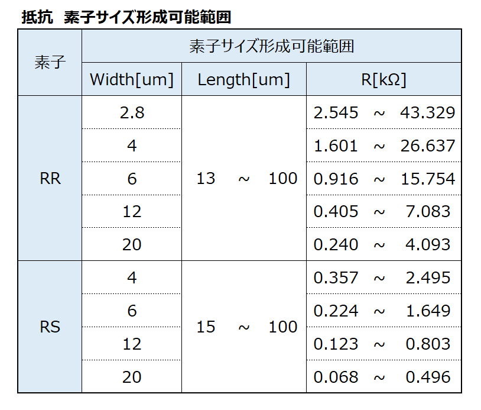  
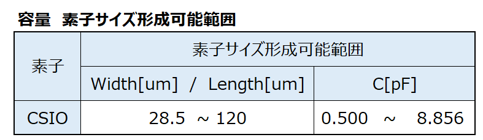  


### 利用可能メタル層
メタル１層（ML1）とメタル２層（ML2）のみ利用可能です。メタル３層（ML3）もレイヤーとして存在しますが、配置配線用に予約されているため、利用できません。  


## ミニマルファブPDKの場合
### コンテスト第一部用のschematic
URAさんによりコンテスト第一部用schematicが提供されましたので、LVSなどをする場合にお使いください。  

[コンテスト第一部用のschematic](./schematic/MF20/base_contest2024_maze_de_inverter.sch)  

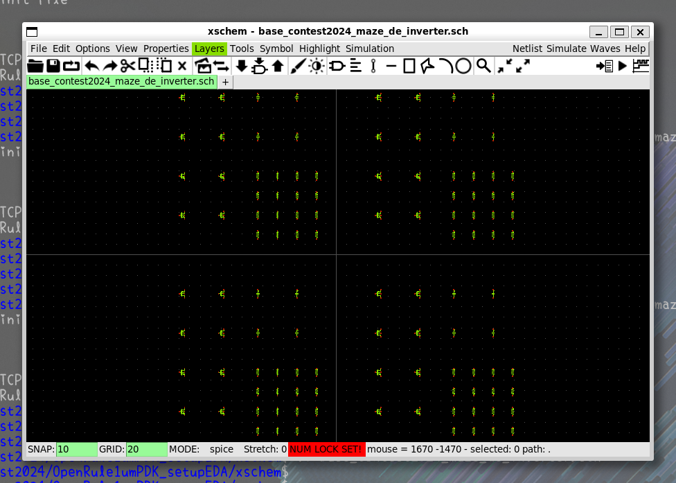


## iHPシャトルPDKの場合

## TinyTapeout PDKの場合


# klayout
## テクノロジーの選択
### フェニテックシャトルPDKと東海理化シャトルPDKの場合
テクノロジーで「OpenRule1umPDK」を選択する。

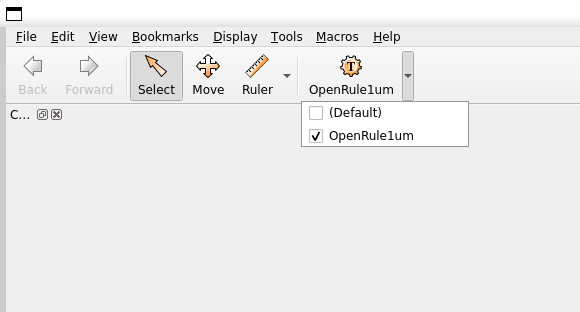

### ミニマルファブPDKの場合
テクノロジーで「ICPS2023_5」を選択する。

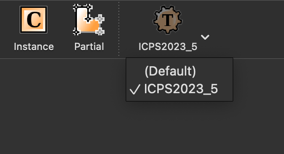


## フレーム
### フェニテックシャトルPDK用
パッドのレイアウトとなります。これをベースに設計してください。  
ピン番号は、下面左端（南面西端）が1番で左回りでカウントします。  

[フレーム用のGDSファイル](./GDS/PTC06/top_frame.gds)
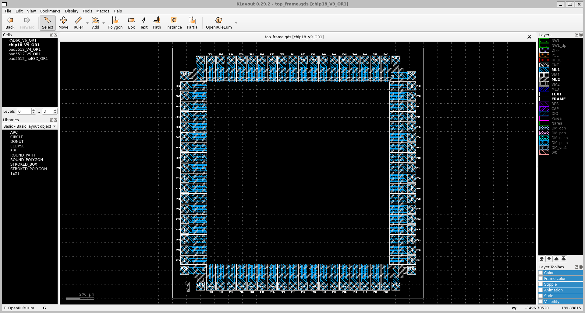

#### パッド
本番のパッドではESD対策が施されています。（ただのメタルがあるだけのように見えますが、最終提出の時にはESD対策が施されたパッドへ置き換わります。）  
もし、アナログ回路の実装などでESD対策が不要や自分で実装したい場合には下記の手順に従ってESD未対策のパッドをお使いください。  

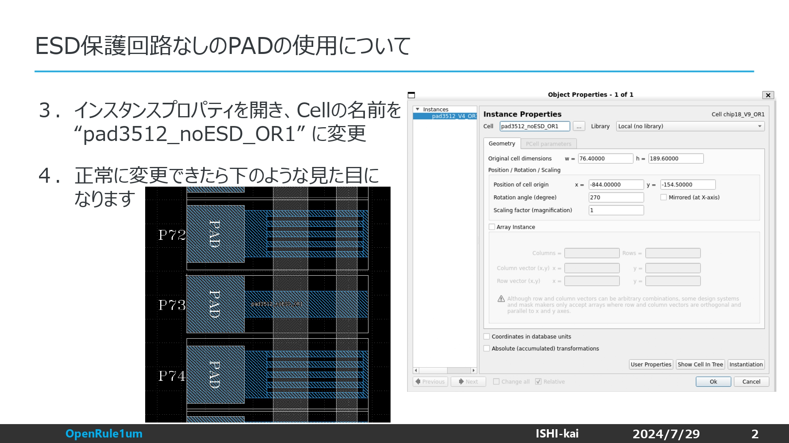
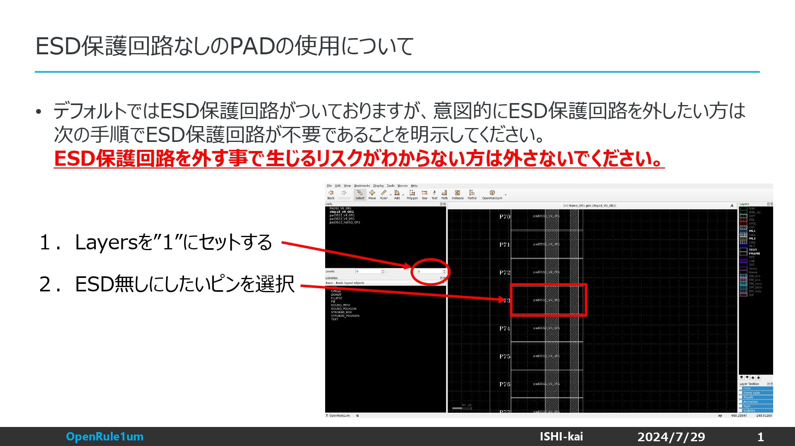


### 東海理化シャトルPDK用
[フレーム用のGDSファイル](./GDS/TR10/top_frame.gds)
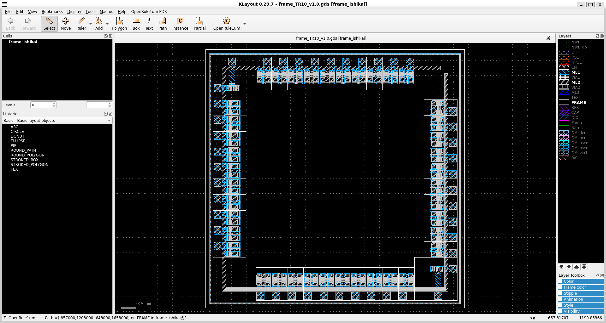


### ミニマルファブPDK用
[フレーム用のGDSファイル](https://github.com/mineda-support/ICPS2023_5/blob/main/Samples/Semicon2023/base_contest2023.GDS)
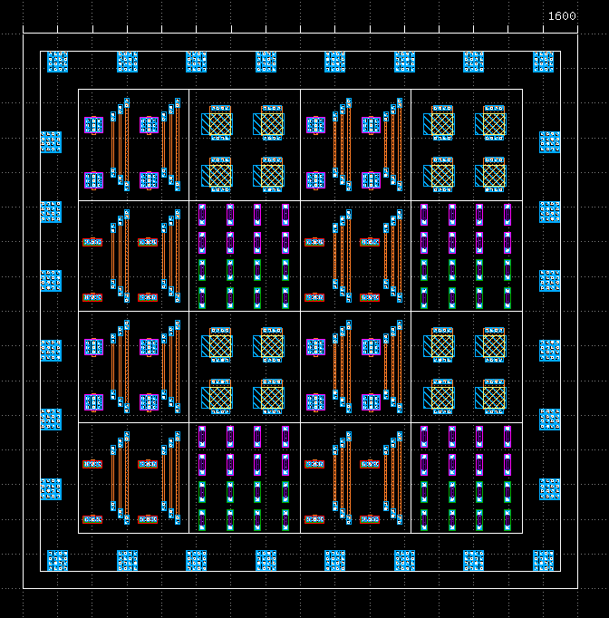


### iHPシャトルPDK用
iHPシャトルに用意されているフレームはありません。ボンディングマシンやパッケージの依頼先に合わせて自分で設計する必要があります。  


### TinyTapeoutPDK用
* [フレーム用のGDSファイル](TT/gds/tt_um_username_projectname.gds)
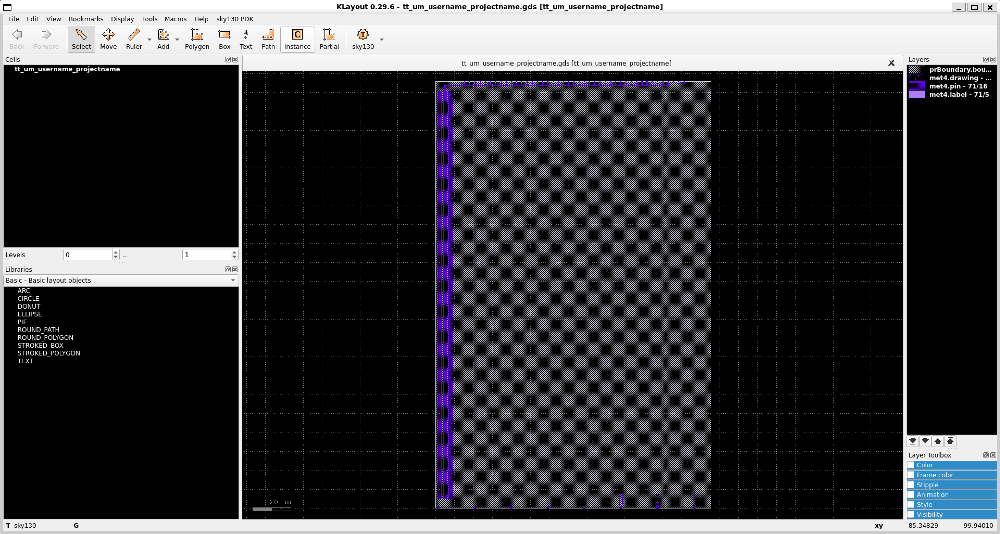


# サンプル
[サンプル](/samples)内に各種サンプルがあります。

# inductorの生成方法
自動生成ツールを用意してあります。  
インダクタシミュレーターの[FastHenry2](https://www.fastfieldsolvers.com/fasthenry2.htm)用のファイルとGDSファイルを生成します。  

- [./generator/inductor_generator.py](./generator/inductor_generator.py) 

## 各種設定
- R
    - 内側の内径[um]
- S
    - ワイヤー間のスペース[um]
- W
    - ワイヤーの幅[um]
- N
    - 巻き数
- T
    - ワイヤーの厚さ[um]
- GuardRing_S
    - inductorからガードリングまでの距離[um]
- GuardRing_W
    - ガードリングのワイヤーの厚さ[um]
- ガードリング
    - inductorは非常に他のワイヤーからの影響を受けやすいため、安全距離として設けているワイヤーの囲み


# オプション
ハンズオンでは使用しませんが、状況により必要となるツール用のセットアップスクリプトです。  
必要に応じてセットアップしてください。  

## QFlow
```
bash eda-qflow-option.sh
```


## Qucs-S
```
bash eda-Qucs-S-option.sh
```


## Xyce
```
bash eda-xyce-option.sh
```


# ライセンス
[LICENSEファイル](LICENSE)
