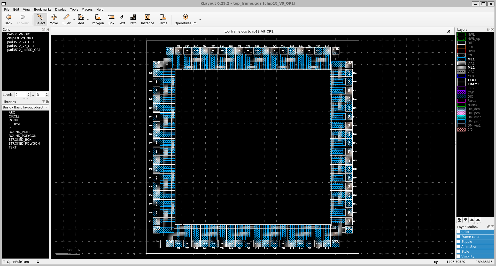
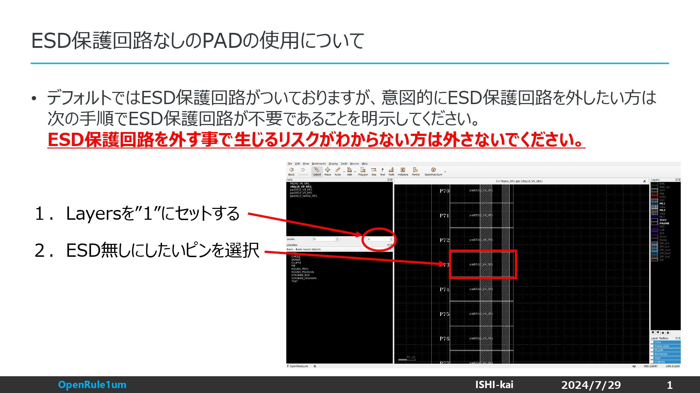

# 何か？
ISHI会版OpenMPW用のレイアウトを作るための環境構築用スクリプトです。  
WSL2 (Windows Subsystem for Linux)上のUbuntu22.04とUbuntu22.04とMac Mコアシリーズで動作します。  

# 実行方法
下記のコマンドを実行するだけです。  

## 共通コマンド
`./eda-setup.sh`

### Mac OS
#### QTの変更
brewのqt@5が必要です。  
qtがインストール済みの場合は削除する必要があります。  

## フェニテックシャトルPDKの場合
`./pdk_PTC06-setup.sh`

## 東海理化シャトルPDKの場合
`./pdk_TR10-setup.sh`

## ミニマルファブPDKの場合
`./pdk_MF20-setup.sh`

## PDKの削除
`uninstall.sh`

PDKを変えたい場合はPDK削除後、PDKのみインストールして下さい。

# xschemの追加設定
## TEGから求めた抵抗・容量の値(2017/9/23:akita11)
### TEGから求めたシート抵抗（カッコ内はTEGのV-I特性から求めた抵抗とL/W）
- Poly : 20Ω□(500Ω, 45um/1.8um)
- Nwell : 1.1kΩ□(10kΩ, 45um/4.8um)
- Nact : - (- , 45um/3.0um)※ダイオード特性となって測定不能
- Pact : 42Ω□(625Ω, 45um/3.0um)

### TEGから求めた容量（カッコ内はTEGのC-f特性から求めた容量とL/W）
- Poly-Metal (ACTEG15) 3.06fF/um^2 (44pF, 120um/120um)
- nMOS Cap (ACTEG14) 5.42fF(蓄積・強反転)/3.82fF(弱反転) (78pF/55pF, 120um/120um)
- pMOS Cap (ACTEG07) 5.34fF(蓄積・強反転)/3.54fF(弱反転) (77pF/51pF, 120um/120um)

# inductorの生成方法
自動生成ツールを用意してあります。  
インダクタシミュレーターの[FastHenry2](https://www.fastfieldsolvers.com/fasthenry2.htm)用のファイルとGDSファイルを生成します。  

- [./generator/inductor_generator.py](./generator/inductor_generator.py) 

## 各種設定
- R
    - 内側の内径[um]
- S
    - ワイヤー間のスペース[um]
- W
    - ワイヤーの幅[um]
- N
    - 巻き数
- T
    - ワイヤーの厚さ[um]
- GuardRing_S
    - inductorからガードリングまでの距離[um]
- GuardRing_W
    - ガードリングのワイヤーの厚さ[um]
- ガードリング
    - inductorは非常に他のワイヤーからの影響を受けやすいため、安全距離として設けているワイヤーの囲み

# klayoutの追加設定
## テクノロジーの選択
テクノロジーで「OpenRule1umPDK」を選択する。

## フレーム
### フェニテックシャトル用
パッドのレイアウトとなります。これをベースに設計してください。  
ピン番号は、下面左端（南面西端）が1番で左回りでカウントします。  

[フレーム用のGDSファイル](./GDS/PTC06/top_frame.gds)

#### パッド
本番のパッドではESD対策が施されています。（ただのメタルがあるだけのように見えますが、最終提出の時にはESD対策が施されたパッドへ置き換わります。）  
もし、アナログ回路の実装などでESD対策が不要や自分で実装したい場合には下記の手順に従ってESD未対策のパッドをお使いください。  

### 東海理化シャトル用
後日アップロード予定

### ミニマルファブ用
[フレーム用のGDSファイル](https://github.com/mineda-support/ICPS2023_5/blob/main/Samples/Semicon2023/base_contest2023.GDS)

# サンプル
[サンプル](/samples)内に各種サンプルがあります。

# ライセンス
[LICENSEファイル](LICENSE)
